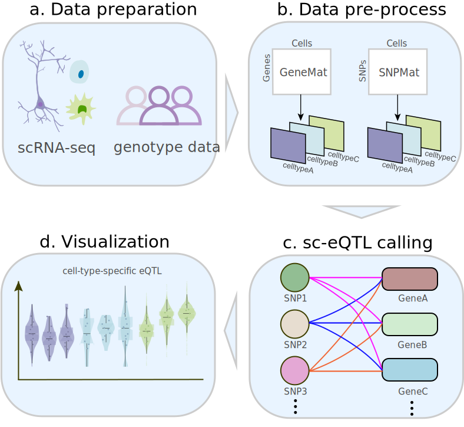
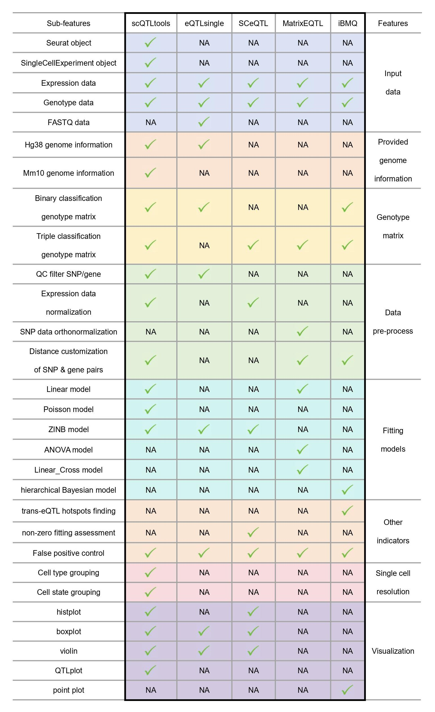

# Introduction
Expression quantitative trait loci (eQTL) analysis links variations in gene 
expression levels to genotypes. This package, scQTLtools, attempts to identify 
genetic variants that affect the gene expression at a single-cell level. It 
also supports cis-eQTL analysis, and provides visualization of the results. 

## Rationale for Bioconductor Submission
By seeking inclusion in Bioconductor, we aim to integrate scQTLtools into a 
well-established ecosystem that is widely used by researchers in 
bioinformatics. Bioconductor's rigorous standards for package quality and its 
focus on reproducibility will enhance the credibility of scQTLtools. 
Additionally, being part of Bioconductor will provide access to a broader user 
base and foster collaboration with other developers, contributing to the 
ongoing improvement and validation of the package.

## Citation

If you find this tool useful, please cite:

------------------------------------------------------------------------

***[https://github.com/XFWu/scQTLtools](https://github.com/XFWu/scQTLtools)***

------------------------------------------------------------------------

# Installation

```{r, eval = FALSE}
if (!require("BiocManager"))
    install.packages("BiocManager")
BiocManager::install("scQTLtools")
```

# Overview of the package

The functions in scQTLtools can be categorized into data pre-process, sc-eQTL 
calling and visualization modules. 

## General Workflow

Each module is summarized as shown below.

{width=90%}

scQTLtools supports input from both gene expression matrices, Seurat objects, 
and SingleCellExperiment objects. It offers three data fitting models and 
enables the analysis of genotype matrices in two forms: ALT and REF, or AA, Aa,
and aa. Additionally, the package includes functionality to filter Gene-SNP 
pairs that are closely positioned in the genome, as nearby SNPs are more likely
to influence gene expression. Moreover, visualization at the single-cell level
demonstrates the specificity of eQTLs across distinct cell types or cellular 
states.

## Comparison and advantages compared to similar works

We compared scQTLtools to other packages with similar functionality, including 
eQTLsingle, SCeQTL, MatrixEQTL, and iBMQ, as shown in the table below.

{width=100%}

Among these tools, scQTLtools stands out for its comprehensive features:

(1) scQTLtools accepts SingleCellExperiment objects and Seurat objects as
input data formats, which are particularly beneficial for users working with
single-cell RNA-seq data, and promote the interoperability with the current
Bioconductor ecosystem. 

(2) scQTLtools supports both binary and triple classification genotype 
matrices, enhancing its applicability across different genetic studies. 

(3) scQTLtools offers extensive data pre-processing capabilities, including 
quality control filtering for SNPs and genes, normalization of expression data, 
and customization of SNP-gene pair distances. This ensures high-quality and 
well-prepared input data for subsequent analysis. 

(4) scQTLtools provides three kinds of fitting models, which cater to various 
data distributions and analysis needs. This diversity allows users to select 
the most appropriate model for their specific dataset. 

(5) scQTLtools includes a range of visualization tools, these options 
facilitate detailed exploration and interpretation of eQTL results at the 
single-cell level. 

(6) scQTLtools supports grouping by both cell type and cell state, which is 
crucial for analyzing the nuanced effects of genetic variants on gene 
expression within heterogeneous cell populations.

Overall, scQTLtools offers a comprehensive suite of features that enhance the 
analysis and interpretation of eQTLs.


# Required input files
The input file requires genotype data, as well as a gene expression matrix or 
a Seurat object, or a SingleCellExperiment object.

- gene expression matrix: describes gene expressions, the row names represent
gene IDs or SYMBOL and the column names represent cell IDs.
- Seurat object: a Seurat object, `yourSeurat@assays$RNA@data` is the gene 
expression matrix after normalizing.
- SingleCellExperiment object: a SingleCellExperiment object, 
`assays(yoursce)$counts)` is raw gene expression matrix, and 
`assays(sce)$normcounts`is the gene expression matrix after normalizing.
- genotype matrix: A genotype matrix where each row is one variant and each 
column is one sample, and the scoring method is 0/1/2/3, 0 represents missing
values, 1 represents ref/ref, 2 represents alt/alt, and 3 represents ref/alt.

The columns of the genotype matrix should correspond to the columns of the gene
expression matrix.

**Example**

```{r input, message=FALSE}
library(scQTLtools)
# gene expression matrix
data(testGene)
# SeuratObject
data(testSeurat)
# load the genotype data
data(testSNP)
data(testSNP2)
```


# Create eqtl object
The createQTLObject class is an R object designed to store data related to eQTL
analysis, encompassing data lists, result data frames, and slots for 
biClassify, species, and group information.

**Example**

```{r createObject_matrix, message=FALSE}
eqtl_matrix <- createQTLObject(
    snpMatrix = testSNP,
    genedata = testGene,
    biClassify = FALSE,
    species = 'human',
    group = NULL)
```

Users can set biClassify to TRUE to change the genotype coding method.

**Example**

```{r createObject_matrix_bi, message=FALSE}
eqtl_matrix_bi <- createQTLObject(
    snpMatrix = testSNP,
    genedata = testGene,
    biClassify = TRUE,
    species = 'human',
    group = NULL)
```

Users can use Seurat object instead of gene expression matrix. 

**Example**

```{r createObject_seuratobject, message=FALSE}
eqtl_seurat <- createQTLObject(
    snpMatrix = testSNP2,
    genedata = testSeurat,
    biClassify = FALSE,
    species = 'human',
    group = "celltype")
```

Users can also take SingleCellExperiment object as input. 

**Example**

```{r createObject_sceobject, message=FALSE}
# create a sce
library(SingleCellExperiment)
sce <- SingleCellExperiment(assays = list(counts = testGene))
eqtl_sce <- createQTLObject(
    snpMatrix = testSNP,
    genedata = sce,
    biClassify = FALSE,
    species = 'human',
    group = NULL)
```


# Normalize gene expression matrix
Use `normalizeGene()` to normalize the gene expression matrix.

**Example**

```{r Normalize_matrix, message=FALSE}
eqtl_matrix  <- normalizeGene(
    eQTLObject = eqtl_matrix, 
    method = "logNormalize")
```

```{r Normalize_sceobject, message=FALSE}
eqtl_sce  <- normalizeGene(
    eQTLObject = eqtl_sce, 
    method = "logNormalize")
```

# Identify the valid gene snp pairs
Here we use `filterGeneSNP()` to filter snp gene pairs.

**Example**

```{r filter_matrix, message=FALSE}
eqtl_matrix <- filterGeneSNP(
    eQTLObject = eqtl_matrix,
    snpNumOfCellsPercent = 2,
    expressionMin = 0,
    expressionNumOfCellsPercent = 2)
```

```{r filter_seuratobject, message=FALSE}
eqtl_seurat <- filterGeneSNP(
    eQTLObject = eqtl_seurat,
    snpNumOfCellsPercent = 2,
    expressionMin = 0,
    expressionNumOfCellsPercent = 2)
```

```{r filter_sceobject, message=FALSE}
eqtl_sce <- filterGeneSNP(
    eQTLObject = eqtl_sce,
    snpNumOfCellsPercent = 2,
    expressionMin = 0,
    expressionNumOfCellsPercent = 2)
```


# Call single cell eQTL
Here we use `callQTL()` to do single cell eQTL analysis.

**Example**

```{r callQTL1_matrix, message=FALSE}
eqtl1_matrix <- callQTL(
    eQTLObject = eqtl_matrix,
    gene_ids = NULL,
    downstream = NULL,
    upstream = NULL,
    gene_mart = NULL,
    snp_mart = NULL,
    pAdjustMethod = "bonferroni",
    useModel = "linear",
    pAdjustThreshold = 0.05,
    logfcThreshold = 0.1)
```

```{r callQTL1_seuratobject, message=FALSE}
eqtl1_seurat <- callQTL(
    eQTLObject = eqtl_seurat,
    gene_ids = NULL,
    downstream = NULL,
    upstream = NULL,
    gene_mart = NULL,
    snp_mart = NULL,
    pAdjustMethod = "bonferroni",
    useModel = "linear",
    pAdjustThreshold = 0.05,
    logfcThreshold = 0.025)
```

```{r callQTL1_sceobject, message=FALSE}
eqtl1_sce <- callQTL(
    eQTLObject = eqtl_sce,
    gene_ids = NULL,
    downstream = NULL,
    upstream = NULL,
    gene_mart = NULL,
    snp_mart = NULL,
    pAdjustMethod = "bonferroni",
    useModel = "linear",
    pAdjustThreshold = 0.05,
    logfcThreshold = 0.025)
```

Users can use the parameter `gene_ids` to select one or several genes of 
interest for identifying sc-eQTLs.

**Example**

```{r callQTL2_matrix, message=FALSE}
eqtl2_matrix <- callQTL(
    eQTLObject = eqtl_matrix,
    gene_ids = c("CNN2", 
                "RNF113A", 
                "SH3GL1", 
                "INTS13", 
                "PLAU"),
    downstream = NULL,
    upstream = NULL,
    gene_mart = NULL,
    snp_mart = NULL,
    pAdjustMethod = "bonferroni",
    useModel = "poisson",
    pAdjustThreshold = 0.05,
    logfcThreshold = 0.1)
```

Users can also use `upstream` and `downstream` to specify SNPs proximal to the
gene in the genome.

**Example**

```{r callQTL3_matrix, message=FALSE} 
eqtl3_matrix <- callQTL(
    eQTLObject = eqtl_matrix,
    gene_ids = NULL,
    downstream = -9e7,
    upstream = 2e8,
    gene_mart = NULL,
    snp_mart = NULL,
    pAdjustMethod = "bonferroni",
    useModel = "poisson",
    pAdjustThreshold = 0.05,
    logfcThreshold = 0.05)
```


# Visualize the result.
Here we use `visualizeQTL()` to visualize the result. There are four types of
plots available to visualize sc-eQTL results. Users can choose "histplot",
"violin", "boxplot", or "QTLplot". 

**Example**

violin plot:

```{r visualizeQTL_matrix, message=FALSE}
visualizeQTL(
    eQTLObject = eqtl1_matrix,
    SNPid = "1:632647",
    Geneid = "RPS27",
    groupName = NULL,
    plottype = "QTLplot",
    removeoutlier = TRUE)
```

QTLplot:

With cell annotation information of Seurat object or SingleCellExperiment 
object, we can discover that the eQTL varies across different cell types.

```{r visualizeQTL_seuratobject, message=FALSE}
visualizeQTL(
    eQTLObject = eqtl1_seurat,
    SNPid = "1:632647",
    Geneid = "RPS27",
    groupName = NULL,
    plottype = "QTLplot",
    removeoutlier = TRUE)
```

In addition, the parameter `groupName` is used to specify a particular
single-cell group of interest.

```{r visualizeQTL_seuratobject_groupName, message=FALSE}
visualizeQTL(
    eQTLObject = eqtl1_seurat,
    SNPid = "1:632647",
    Geneid = "RPS27",
    groupName = "GMP",
    plottype = "QTLplot",
    removeoutlier = TRUE)
```

boxplot:

```{r visualizeQTL_sceobject, message=FALSE}
visualizeQTL(
    eQTLObject = eqtl1_sce,
    SNPid = "1:632647",
    Geneid = "RPS27",
    groupName = NULL,
    plottype = "boxplot",
    removeoutlier = TRUE)
```


# References
1. Miao, Z., Deng, K.e., Wang, X., Zhang, X., Berger, B., 2018. DEsingle for
detecting three types of differential expression in single-cell RNA-seq data.
Bioinformatics 34 (18), 3223–3224.
<https://doi.org/10.1093/bioinformatics/bty332>
2. Hu, Y., Xi, X., Yang, Q., Zhang, X., 2020. SCeQTL: An R package for
identifying eQTL from single-cell parallel sequencing data. BMC Bioinformatics
21, 1–12. <https://doi.org/10.1186/s12859-020-3534-6>
3. Nathan, A., Asgari, S., Ishigaki, K. et al. Single-cell eQTL models reveal
dynamic T cell state dependence of disease loci. Nature 606, 120–128 (2022).
<https://doi.org/10.1038/s41586-022-04713-1>
4. Ma, T. ,  Li, H. , &  Zhang, X. . (2021). Discovering single-cell eQTLs from
scRNA-seq data only. Cold Spring Harbor Laboratory.
5. Schmiedel, B. J., Gonzalez-Colin, C., Fajardo, V., Rocha, J., Madrigal, A.,
Ramírez-Suástegui, C., Bhattacharyya, S., Simon, H., Greenbaum, J. A., Peters,
B., Seumois, G., Ay, F., Chandra, V., & Vijayanand, P. (2022). Single-cell eQTL
analysis of activated T cell subsets reveals activation and cell type-dependent
effects of disease-risk variants. Science immunology, 7(68), eabm2508.
<https://doi.org/10.1126/sciimmunol.abm2508>
6. Imholte, G. C. ,  Marie-Pier, S. B. , Labbe Aurélie,  
Deschepper, C. F. , &  Raphael, G. . (2013). Ibmq: a r/bioconductor package for
integrated bayesian modeling of eqtl data. Bioinformatics(21), 2797-2798.
<https://doi.org/10.1093/bioinformatics/btt485>

# Session Info

```{r}
sessionInfo()
```

