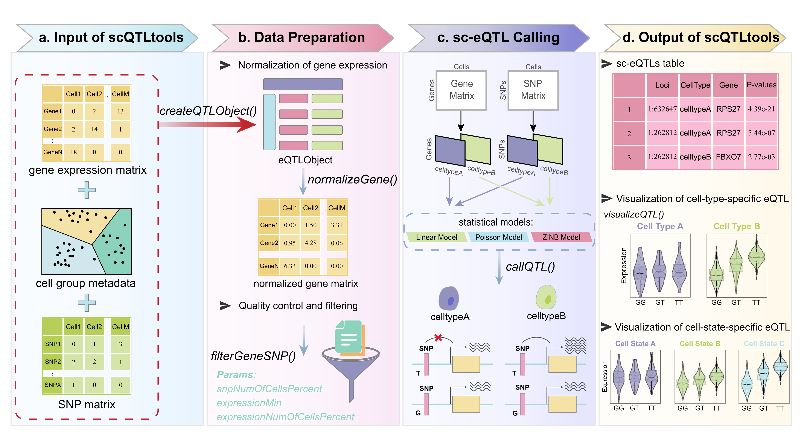

# Introduction
Single-cell RNA sequencing (scRNA-seq) enables expression quantitative trait 
locus (eQTL) analysis at cellular resolution, offering new opportunities to 
uncover regulatory variants with cell-type-specific effects. However, existing 
tools are often limited in functionality, input compatibility, or scalability 
for sparse single-cell data. To address these challenges, we developed 
scQTLtools, a comprehensive R/Bioconductor package that facilitates end-to-end
single-cell eQTL analysis, from preprocessing to visualization. The toolkit 
supports flexible input formats, including Seurat and SingleCellExperiment 
objects, handles both binary and three-class genotype encodings, and provides 
dedicated functions for gene expression normalization, SNP and gene filtering, 
eQTL mapping, and versatile result visualization. To accommodate diverse data
characteristics, scQTLtools implements three statistical models—linear 
regression, Poisson regression, and zero-inflated negative binomial regression.
We applied scQTLtools to scRNA-seq data from human acute myeloid leukemia and
identified eQTLs with regulatory effects that varied across cell types. 
Visualization of SNP–gene pairs revealed both positive and negative 
associations between genotype and gene expression. These results demonstrate 
the ability of scQTLtools to uncover cell-type-specific regulatory variation 
that is often missed by bulk eQTL analyses. Overall, scQTLtools offers a 
robust, flexible, and user-friendly framework for dissecting 
genotype-expression relationships in heterogeneous cellular populations.

## Rationale for Bioconductor Submission
By seeking inclusion in Bioconductor, we aim to integrate scQTLtools into a 
well-established ecosystem that is widely used by researchers in 
bioinformatics. Bioconductor's rigorous standards for package quality and its 
focus on reproducibility will enhance the credibility of scQTLtools. 
Additionally, being part of Bioconductor will provide access to a broader user 
base and foster collaboration with other developers, contributing to the 
ongoing improvement and validation of the package.

## Citation

If you find this tool useful, please cite:

------------------------------------------------------------------------

***[https://github.com/XFWuCN/scQTLtools](https://github.com/XFWuCN/scQTLtools)***

***[https://bioconductor.org/packages/3.21/bioc/html/scQTLtools.html](https://bioconductor.org/packages/3.21/bioc/html/scQTLtools.html)***

***[https://bioconductor.org/packages/devel/bioc/html/scQTLtools.html](https://bioconductor.org/packages/devel/bioc/html/scQTLtools.html)***

------------------------------------------------------------------------

# Installation

```{r, eval = FALSE}
if (!require("BiocManager"))
    install.packages("BiocManager")
BiocManager::install("scQTLtools")
```

# Overview of the package

The functions in scQTLtools can be categorized into data input, data 
pre-process, sc-eQTL calling and visualization modules. The functions and their
brief descriptions are summarized below.

## General Workflow

Each module is summarized as shown below.

{width=100%}

scQTLtools requires two key input data: a single-cell gene expression dataset 
and a corresponding SNP genotype matrix. The single-cell gene expression
dataset can be either a gene expression matrix or an object such as a Seurat v4 
object or a Bioconductor SingleCellExperiment object. The input genotype matrix 
should follow a 0/1/2/3 encoding scheme: 1 for homozygous reference genotype, 2 
for homozygous alternative genotype, 3 for heterozygous genotype, and 0 for 
missing values. Moreover, scQTLtools can support a simplified 0/1/2 
encoding scheme, where 2 denotes a non-reference genotype. 
Additionally, the package includes functionality to normalize the raw 
single-cell gene expression matrix, and filter SNP–gene pairs. After 
pre-process, scQTLtools implements the `callQTL()` function to identify 
sc-eQTLs. 
Moreover, visualization at the single-cell level demonstrates the specificity 
of eQTLs across distinct cell types or cellular states.

## Comparison and advantages compared to similar works

We compared scQTLtools to other packages with similar functionality, including 
eQTLsingle, SCeQTL, Matrix eQTL, and iBMQ, as shown in the table below.

{width=100%}

Among these tools, scQTLtools stands out for its comprehensive features:

(1) scQTLtools accepts SingleCellExperiment object and Seurat object as
input data formats, which are particularly beneficial for users working with
single-cell RNA-seq data, and promote the interoperability with the current
Bioconductor ecosystem. 

(2) scQTLtools supports both binary and three-class genotype encodings, 
enhancing its applicability across different genetic studies. 

(3) scQTLtools offers extensive data pre-processing capabilities, including 
quality control filtering for SNPs and genes, and normalization of raw gene 
expression matrix. Users can also customize the genomic window for defining 
SNP–gene pairs, enabling flexible cis-eQTL discovery. 

(4) scQTLtools provides three commonly used statistical models, which cater to 
various data distributions and analysis needs. This diversity allows users to 
select the most appropriate model for their specific dataset. 

(5) scQTLtools includes a wide range of visualization tools, which facilitate 
detailed exploration and interpretation of eQTL results at the single-cell 
level. 

(6) scQTLtools supports grouping by both cell type and cell state, which is 
crucial for analyzing the nuanced effects of genetic variants on gene 
expression within heterogeneous cell populations.

Overall, scQTLtools offers a comprehensive suite of features that enhance the 
analysis and interpretation of eQTLs.


# Required input files
The input file requires a single-cell gene expression dataset and a 
corresponding SNP genotype matrix. The single-cell gene expression dataset can 
be either a gene expression matrix or an object such as a Seurat v4 object or a Bioconductor SingleCellExperiment object.

- gene expression matrix: describes gene expressions, each row represents a
gene and each column represents a cell.
- Seurat object/SingleCellExperiment object: a Seurat/SingleCellExperiment 
object.
- SNP genotype matrix: A matrix where each row represents a variant and each 
column a cell, using a 0/1/2/3 encoding scheme.

The columns (cells) of the genotype matrix should correspond to the columns 
(cells) of the gene expression matrix.

**Example**

```{r input, message = FALSE}
library(scQTLtools)
# gene expression matrix
data(GeneData)
# SeuratObject
data(Seurat_obj)
# load the genotype data
data(SNPData)
data(SNPData2)
```


# Create eQTL object
The createQTLObject class is an R object designed to store data related to eQTL
analysis, encompassing data lists, result data frames, and slots for 
biClassify, species, and group information.

**Example**

```{r createObject_matrix, message = FALSE}
eqtl_matrix <- createQTLObject(
    snpMatrix = SNPData,
    genedata = GeneData,
    biClassify = FALSE,
    species = 'human',
    group = NULL)
```

Users can set `biClassify` to TRUE to change the genotype encoding mode.

**Example**

```{r createObject_matrix_bi, message = FALSE}
eqtl_matrix_bi <- createQTLObject(
    snpMatrix = SNPData,
    genedata = GeneData,
    biClassify = TRUE,
    species = 'human',
    group = NULL)
```

Users can use Seurat object instead of gene expression matrix. 

**Example**

```{r createObject_seuratobject, message = FALSE}
eqtl_seurat <- createQTLObject(
    snpMatrix = SNPData2,
    genedata = Seurat_obj,
    biClassify = FALSE,
    species = 'human',
    group = "celltype")
```

Users can also take SingleCellExperiment object as input. 

**Example**

```{r createObject_sceobject, message = FALSE}
# Create a SingleCellExperiment object
library(SingleCellExperiment)
sce <- SingleCellExperiment(assays = list(counts = GeneData))
eqtl_sce <- createQTLObject(
    snpMatrix = SNPData,
    genedata = sce,
    biClassify = FALSE,
    species = 'human',
    group = NULL)
```


# Normalize the raw gene expression matrix
Use `normalizeGene()` to normalize the raw gene expression matrix.

**Example**

```{r Normalize_matrix, message = FALSE}
eqtl_matrix  <- normalizeGene(
    eQTLObject = eqtl_matrix, 
    method = "logNormalize")
```

```{r Normalize_sceobject, message = FALSE}
eqtl_sce  <- normalizeGene(
    eQTLObject = eqtl_sce, 
    method = "logNormalize")
```

# Identify the valid SNP–gene pairs
Here we use `filterGeneSNP()` to filter SNP–gene pairs.

**Example**

```{r filter_matrix, message = FALSE}
eqtl_matrix <- filterGeneSNP(
    eQTLObject = eqtl_matrix,
    snpNumOfCellsPercent = 2,
    expressionMin = 0,
    expressionNumOfCellsPercent = 2)
```

```{r filter_seuratobject, message = FALSE}
eqtl_seurat <- filterGeneSNP(
    eQTLObject = eqtl_seurat,
    snpNumOfCellsPercent = 2,
    expressionMin = 0,
    expressionNumOfCellsPercent = 2)
```

```{r filter_sceobject, message = FALSE}
eqtl_sce <- filterGeneSNP(
    eQTLObject = eqtl_sce,
    snpNumOfCellsPercent = 2,
    expressionMin = 0,
    expressionNumOfCellsPercent = 2)
```


# Identify single-cell eQTLs
Here we use `callQTL()` to perform single cell eQTL analysis.

**Example**

```{r callQTL1_matrix, message = FALSE}
eqtl1_matrix <- callQTL(
    eQTLObject = eqtl_matrix,
    gene_ids = NULL,
    downstream = NULL,
    upstream = NULL,
    gene_mart = NULL,
    snp_mart = NULL,
    pAdjustMethod = "bonferroni",
    useModel = "linear",
    pAdjustThreshold = 0.05,
    logfcThreshold = 0.1)
```

```{r callQTL1_seuratobject, message = FALSE}
eqtl1_seurat <- callQTL(
    eQTLObject = eqtl_seurat,
    gene_ids = NULL,
    downstream = NULL,
    upstream = NULL,
    gene_mart = NULL,
    snp_mart = NULL,
    pAdjustMethod = "bonferroni",
    useModel = "linear",
    pAdjustThreshold = 0.05,
    logfcThreshold = 0.025)
```

```{r callQTL1_sceobject, message = FALSE}
eqtl1_sce <- callQTL(
    eQTLObject = eqtl_sce,
    gene_ids = NULL,
    downstream = NULL,
    upstream = NULL,
    gene_mart = NULL,
    snp_mart = NULL,
    pAdjustMethod = "bonferroni",
    useModel = "linear",
    pAdjustThreshold = 0.05,
    logfcThreshold = 0.025)
```

Users can use the parameter `gene_ids` to select one or several genes of 
interest for identifying sc-eQTLs.

**Example**

```{r callQTL2_matrix, message = FALSE}
eqtl2_matrix <- callQTL(
    eQTLObject = eqtl_matrix,
    gene_ids = c("CNN2", 
                "RNF113A", 
                "SH3GL1", 
                "INTS13", 
                "PLAU"),
    downstream = NULL,
    upstream = NULL,
    gene_mart = NULL,
    snp_mart = NULL,
    pAdjustMethod = "bonferroni",
    useModel = "poisson",
    pAdjustThreshold = 0.05,
    logfcThreshold = 0.1)
```

Users can also set `upstream` and `downstream` to specify SNPs proximal to the
gene in the genome.

**Example**

```{r callQTL3_matrix, message = FALSE} 
eqtl3_matrix <- callQTL(
    eQTLObject = eqtl_matrix,
    gene_ids = NULL,
    downstream = -9e7,
    upstream = 2e8,
    gene_mart = NULL,
    snp_mart = NULL,
    pAdjustMethod = "bonferroni",
    useModel = "poisson",
    pAdjustThreshold = 0.05,
    logfcThreshold = 0.05)
```


# Visualize the results.
Use `visualizeQTL()` to visualize sc-eQTL results. Four plot types are 
supported: "histplot", "violin", "boxplot", or "QTLplot". 

**Example**

violin plot:

```{r visualizeQTL_matrix, message = FALSE}
visualizeQTL(
    eQTLObject = eqtl1_matrix,
    SNPid = "1:632647",
    Geneid = "RPS27",
    groupName = NULL,
    plottype = "QTLplot",
    removeoutlier = TRUE)
```

QTLplot:

By incorporating cell annotation from Seurat or SingleCellExperiment objects, 
scQTLtools can reveal cell-type-specific patterns of eQTL effects.

```{r visualizeQTL_seuratobject, message = FALSE}
visualizeQTL(
    eQTLObject = eqtl1_seurat,
    SNPid = "1:632647",
    Geneid = "RPS27",
    groupName = NULL,
    plottype = "QTLplot",
    removeoutlier = TRUE)
```

In addition, the parameter `groupName` is used to specify a particular
single-cell group of interest.

```{r visualizeQTL_seuratobject_groupName, message = FALSE}
visualizeQTL(
    eQTLObject = eqtl1_seurat,
    SNPid = "1:632647",
    Geneid = "RPS27",
    groupName = "GMP",
    plottype = "QTLplot",
    removeoutlier = TRUE)
```

boxplot:

```{r visualizeQTL_sceobject, message = FALSE}
visualizeQTL(
    eQTLObject = eqtl1_sce,
    SNPid = "1:632647",
    Geneid = "RPS27",
    groupName = NULL,
    plottype = "boxplot",
    removeoutlier = TRUE)
```


# References
1. Miao, Z., Deng, K.e., Wang, X., Zhang, X., Berger, B., 2018. DEsingle for
detecting three types of differential expression in single-cell RNA-seq data.
Bioinformatics 34 (18), 3223–3224.
<https://doi.org/10.1093/bioinformatics/bty332>
2. Hu, Y., Xi, X., Yang, Q., Zhang, X., 2020. SCeQTL: An R package for
identifying eQTL from single-cell parallel sequencing data. BMC Bioinformatics
21, 1–12. <https://doi.org/10.1186/s12859-020-3534-6>
3. Nathan, A., Asgari, S., Ishigaki, K. et al. Single-cell eQTL models reveal
dynamic T cell state dependence of disease loci. Nature 606, 120–128 (2022).
<https://doi.org/10.1038/s41586-022-04713-1>
4. Ma, T. ,  Li, H. , &  Zhang, X. . (2021). Discovering single-cell eQTLs from
scRNA-seq data only. Cold Spring Harbor Laboratory.
<https://doi.org/10.1016/j.gene.2022.146520>
5. Schmiedel, B. J., Gonzalez-Colin, C., Fajardo, V., Rocha, J., Madrigal, A.,
Ramírez-Suástegui, C., Bhattacharyya, S., Simon, H., Greenbaum, J. A., Peters,
B., Seumois, G., Ay, F., Chandra, V., & Vijayanand, P. (2022). Single-cell eQTL
analysis of activated T cell subsets reveals activation and cell type-dependent
effects of disease-risk variants. Science immunology, 7(68), eabm2508.
<https://doi.org/10.1126/sciimmunol.abm2508>
6. Imholte, G. C. ,  Marie-Pier, S. B. , Labbe Aurélie,  
Deschepper, C. F. , &  Raphael, G. . (2013). Ibmq: a r/bioconductor package for
integrated bayesian modeling of eqtl data. Bioinformatics(21), 2797-2798.
<https://doi.org/10.1093/bioinformatics/btt485>
7. Shabalin A. A. (2012). Matrix eQTL: ultra fast eQTL analysis via large
matrix operations. Bioinformatics (Oxford, England), 28(10), 1353–1358. <https://doi.org/10.1093/bioinformatics/bts163>

# Session Info

```{r}
sessionInfo()
```

